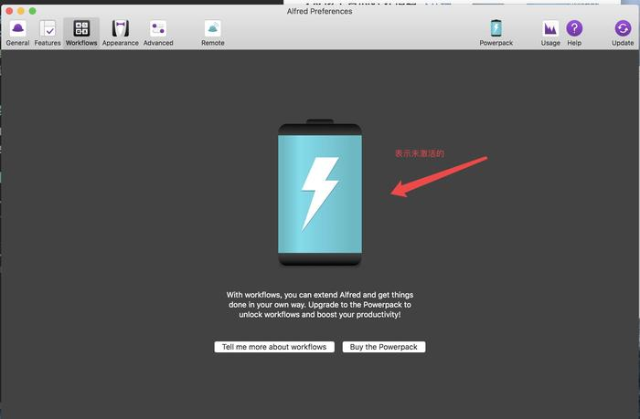
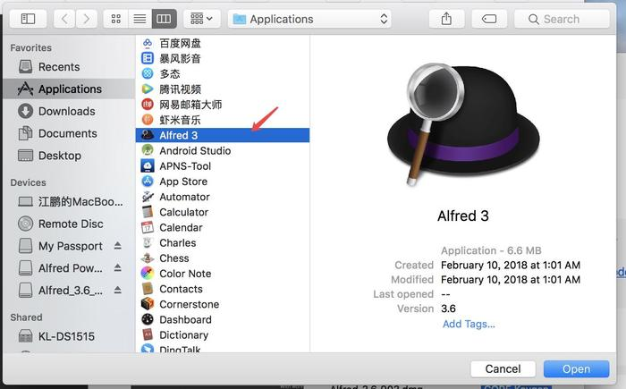
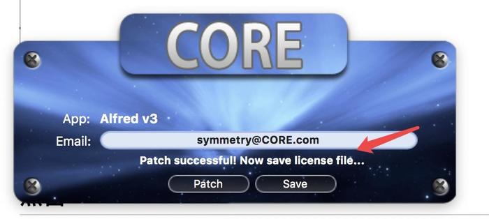
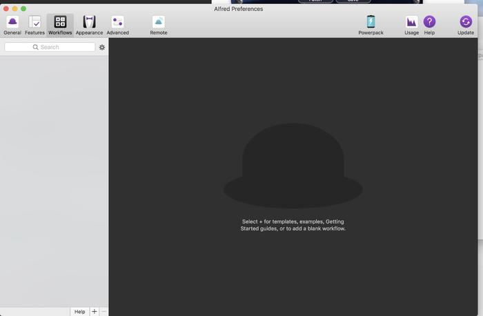

## 使用说明

首先从 [Alfred 官网](https://www.alfredapp.com/) 自行下载安装 `Alfred`，免费用户可以使用除 `Workflow` 以外的其它功能，如需使用 `Workflow`，则需要购买 `Powerpack`。

如果你不知道 `Alfred`, 请看 [这篇文章](https://lhajh.github.io/mac/2018/06/01/Alfred.html)

软件默认是未激活 `Powerpack` 的, 如图:

下载本页面的 [CORE Keygen.app](https://github.com/lhajh/Alfred-Powerpack/archive/master.zip)

双击打开 `CORE Keygen.app`, 点击 `path`, 在弹出框选择 `Alfred`, 如下图:

点击 `open`, 如果弹出需要安装 `Xcode`, 则必须安装, 否则无法破解; 若未弹出, 则表示系统已安装, 可以进行下一步

点击 `Save`, 提示 `License information saved successfully` 表示激活成功

此时查看软件也表示激活成功

